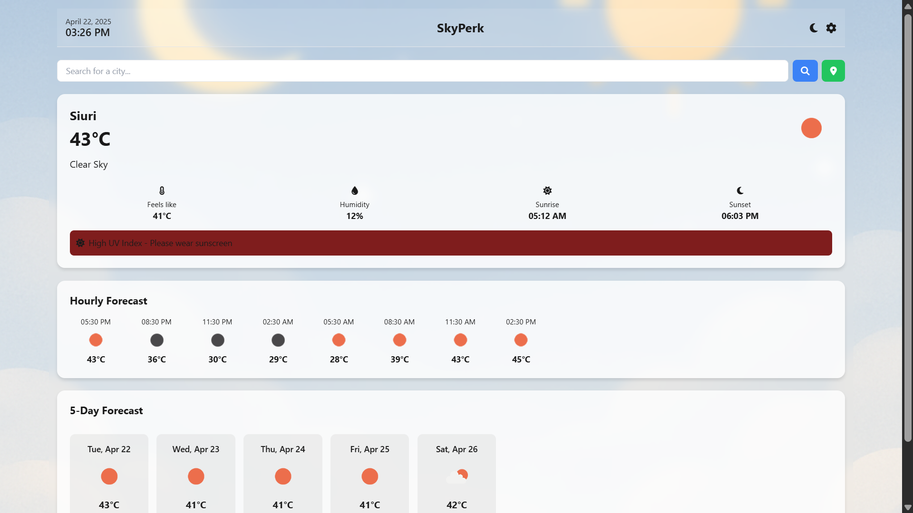
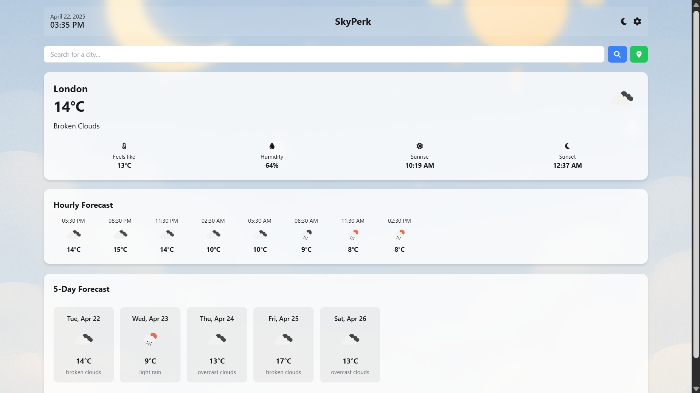
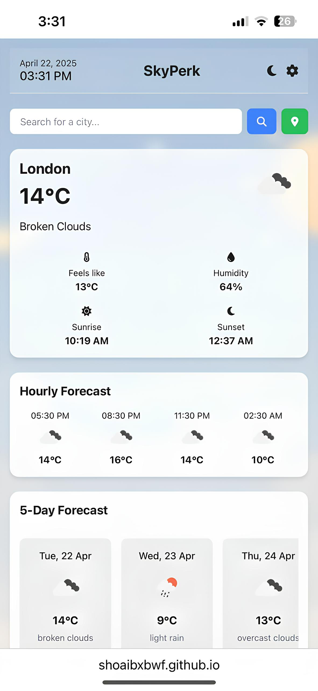

# 🌤️ Skyperk – Your Personal Weather App

**Skyperk** is a beautifully crafted, multilingual weather app that delivers accurate, real-time weather updates for any city around the globe. With a modern UI, battery-saving mode, and support for multiple languages, Skyperk is designed to offer an elegant and personalized experience – anytime, anywhere.

---

## ✨ Features

- 🌍 **Global City Weather Search**
- 🕒 **Live Weather Data** (Temperature, Humidity, Wind, Clouds)
- 🗺️ **Displays Country Name with National Flag**
- 🌡️ **5-Day Forecast** with scrollable horizontal layout
- 🌗 **Dark & Light Themes** with auto-save via `localStorage`
- 💾 **Set a Default Location** for quick access to your favorite city
- 🔋 **Battery Saving Mode** for efficient performance
- 🌐 **Multilingual Support** – Available in **English**, **Hindi**, and **Urdu**
- ⌨️ **Search via Enter Key or Button**
- 📱 **Fully Responsive** – Seamless across all devices
- ⚡ **Smooth Error Handling & Fast Load Times**

---

## 🖼️ Preview

  
*A sleek, responsive UI with real-time weather info tailored for you!*

---

## 🚀 Live Demo

🔗 [Try Skyperk Now](https://shoaibxbwf.github.io/WeatherApp/)

---

## 📲 Download for Android

🔗 [Download Android Version](https://shoaibxbwf.github.io/DownloadPage/)

---

## 📦 Tech Stack

- **HTML5**
- **CSS3**
- **JavaScript (ES6)**
- **OpenWeatherMap API**
- **FlagsAPI** for country flag display

---

## 🔐 API Setup

Skyperk uses the **OpenWeatherMap API** for fetching accurate weather data.  
To use your own API key:

1. Sign up at [openweathermap.org/api](https://openweathermap.org/api)
2. Replace the API key placeholder in your `script.js`

---

## 🧠 Smart Features

- 🕹 **Theme Toggle:** Light 🌞 / Dark 🌙 mode saved in localStorage  
- 📍 **Default Location:** Set once, check it anytime  
- 🔋 **Battery Saver Mode:** Less animation, optimized fetch  
- 🌐 **Language Selection:** UI adapts to your preferred language

---

## 📸 Screenshots

| 💻 Desktop View | 📱 Mobile View |
|----------------|----------------|
|  |  |

---

## 🚧 Planned Enhancements

- 🌦️ **Animated Backgrounds** based on live weather
- 📍 **Auto-detect Location** via Geolocation API
- 🧩 **PWA Support** for installable experience
- 🗣️ **Voice Search Integration**

---

## 👨‍💻 Developed By

**Mohammad Amir Shoaib**  
💻 BCA Student | Front-End Web Developer  
📧 astechnical112@gmail.com  
🌐 [GitHub: @shoaibxbwf](https://github.com/shoaibxbwf)

---

## ⭐ Support & Feedback

If you enjoy using Skyperk, please give it a ⭐ on [GitHub](https://github.com/shoaibxbwf/WeatherApp) and share it with your friends!  
Have ideas or suggestions? I'd love to hear from you.
